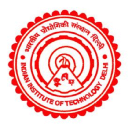

<!---
 --->

# **C**ontamination **A**ssessment and **S**ite management **T**ool (**CAST**)
------------------------

**CAST** provides an online application for the assessment of contaminated sites, specially for BTEX-type contaminations. The specific highlight is a web-based application for calculating steady-state plume length $L_{max}$ using [MODFLOW](http://tiny.cc/kon6jz) and [MT3D-MS](http://tiny.cc/6pn6jz).

**The site can be assessed from www.cast.iitd.ac.in **

**NOTE:**
_Authors and organizations credited on this page or on the above-mentioned website are NOT responsible for any results or output obtained from using the website or the codes provided here_

[Flask](https://palletsprojects.com/p/flask/) micro web-framework is used for the web-application development. The front end has been designed using HTML, CSS and bootstrap, the back-end is being handled by the open source management system, MySQL and Python(3.6.8). The application currently can already be used for:

1. **Statistical Analysis of Contaminated sites:**
   * Large contaminated site database
   * Statistical measures and visualizations of important site quantities

2. **Analytical Models for steady-state plume length $(L_{max})$ estimations:**
    * 2D Vertical Model (Liedl et al., 2005)
    * 2D Horizontal Model (Ham et al. 2005, Chu et al., 2005)
    * 3D Model (Liedl et al., 2011)
    * More to be added ...,

3. **Empirical Models for $L_{max}$ estimations:**
   * 2D Vertical (Maier and Grathwohl, 2005)
   * 2D Vertical with richarge (Birla et al. 2019 - in revision)
   * More to be added ...,

4. **Numerical Models for plume length estimations:**
    * Web-interface for MODFLOW/MT3DMS
    * Single reactant reactive transport model based on Yadav et al., 2013.
    * More in the development ...,

5.  **Decision model for selection of model for site-assessment**
    * Based on Yadav et al., 2020 (in revision)

The codes on this site are licensed under Creative Commons CC BY-SA 4.0. Please check license.md for license wordings.  

## The development organization and members ##

The following organizations has been supporting the development:

1. Department of Civil Engineering, Indian Institute of Technology Delhi (IITD), Delhi, India  

* Web-site hosting at: http://www.iitd.ac.in/
* Funding through: 
     1. Professional Development Fund of Prof B R Chahar 
     2. Ministry of Water Resources, Govt of India

2. Institute for Groundwater Management, Technical University of Dresden (TUD), Dresden, Germany  

*  Partially through DFG fund (LI 727/29-1)   

3. Department of Civil Engineering and Information Technology, Manipal University Jaipur (MUJ), Jaipur, India

**Team members for the development** (not in any order):

1. Prof. B. R. Chahar 1
2. Prof. R. Liedl 2
3. Ms. Vedaanti Baliga 1, 3, +
4. Dr. Prabhas K Yadav 2, 3,  ++
5. Ms. Sandhya Birla 1
6. Mr. Anton Köhler 2, +*
7. M.Sc. Shamsuddin Daulat 2, **
8. Mr. Aditya Kumar(from NIT Trichy, India.)

+_Technical lead, full stack development and deployment,_
++_Concept development and coding,_
+*_Numerical model interface and code development,_
**_Decison model and code development_

**Deployment of application at IIT :**
* This application has its storage on <a href="https://baadal.iitd.ac.in/baadal">Baadal</a>, which is a cloud orchestration and virtualization management software developed at IITD
* It has been deployed on an Ubuntu 16.04 server with 2CPU, 4GB RAM and 80GB HDD

**For citing:**

Coming soon ...,

**Screenshots of the web-based interface :**

 
 > Main computing page (Toolbox)

 
 > Database management

 
 > Single computing interface

 
 > Data visualisation

 

 
 > Numerical Model

### More to be continued...  ###
